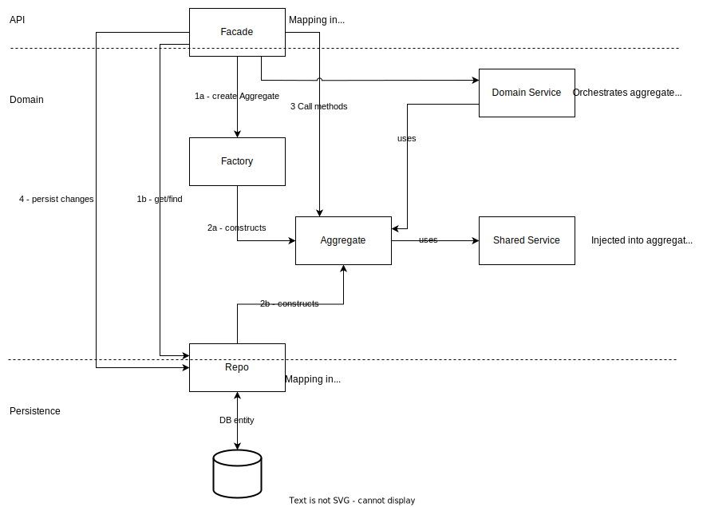

# Architecture

## Domain Driven Design

We follow the principles of domain driven design. 
Business logic is handled in the domain layer.

Business logic is mainly handled within an Aggregate. If that is not possible, e.g. because an operation affects multiple aggregates a Domain Service is used. 

## Components

### Controllers

To expose a Web-API we use Controllers. Controllers call Aggregates and Domain Services. Controllers expose DTOs with Decorators to generate the OpenApi Specification. 
The Controllers' main purpose ist to map the API of the domain into a Web-API. Controllers might do a bit on orchestration, but it should be kept at a minimum.

### Repositories

Repositories persists Aggregats and thus are in the persistence layer. But Repos provide methods in the domain layer and thus are in the domain layer as well.
Therefore a Repository must not expose any data structures related to the persistence layer i.e. DB-entities or ORM related classes or types.
A Repository should not provide multi purpose methods. If an Aggregate or controller needs to search with specific parameters we create a method just for these specific parameters.

We can have Repositories that are exported by their module and internal Repositories that can only be used within their module. (See [Authorization](#authorizationpermission-checks))

### Services

If orchestration of multiple Repositories and Aggregates is necessary, this is done in a Domain Service.

A Domain Service has a specific purpose. Good: PersonDeleteService. ~~Bad: PersonService~~

There are services for cross-cutting concerns as well like logging or configuration. They be injected into any component.

### Example of a typical call:

1. The *controller* calls  
    a. the *factory* to create a new instance of an *aggregate* 
    b. the *repository* to load or
2. *factory* (a) or *repository* (b) construct an instance of the *aggregate*
3. The *controller* calls methods of the *aggregate*
4. the *controller* persists changes by calling the *repository* with the *aggregate* as parameter

## Modules

A module contains a cohesive portion of the domain.  

A module usually contain classes for internal use only and classes that are meant to be consumed by other modules. 
Take a concious decision what classes to put in the module's `exports`-array instead of defaulting to export everything "just in case". See [Authorization](#authorizationpermission-checks)

## Authorization/Permission Checks

Authorization is done in the Domain Layer. 
Every public method in a class that is exported by a module should check the necessary permissions.

The controller methods get injected the PersonPermissions object. The PersonPermissions object is passed on to the Repositories and Services as a parameter.

Authorization is done by

- a Repository while loading or persisting the Aggregate.
- a Domain Service before orchestrating Repositories and Aggregates.

In case multiple Repositories are called for one request we would check the same permissions repeatedly. To avoid that, we check the permissions in the Domain Service instead of the Repository. 
Any Repository that offers even a single method without permission check, needs to be an internal Repository. Internal Repositories are not exported by their module, so that no Controller and no other module can bypass the permission check.

We do not rely on authorization checks in the controllers. If you want to check permissions in the controller to avoid checking multiple times per request, then you probably should be using a Domain Service for permission check and orchestration instead 

## Integrity Checks

We need check conditions for data integrity e.g. an organisation of type form (Klasse) can not be administrated by an organisation of type school sponsor (Schulträger), but only by a school.
To check these conditions we use the specification pattern for reusability.
An Aggregate can run its own Specifications. This can be done while creating the Aggregate.

Before persisting an aggregate the Specifications need to be checked. The Repository must trigger the check. We do not rely on the controller to do it reliably same as the permission checks.
