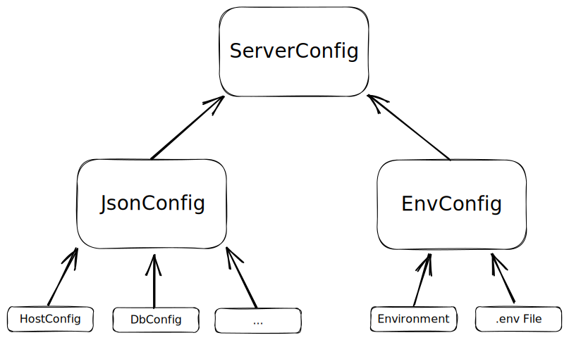

# Configuration

> This site explains how configuration is implemented and gives guidelines on
> how to extend or implemented your own configuration modules. For configuration
> we are using the [@nestjs/config](https://www.npmjs.com/package/@nestjs/config)
> package which is also documented on the [nestjs](https://docs.nestjs.com/techniques/configuration)
> documentation site.

## Overview

### General Configuration

There is are multiple 'base'-configurations, that are used for local development and testing purposes. These json files follow the structure of the classes in (src/shared/config/json.config.ts)[../src/shared/config/json.config.ts]

- Used when starting the backend locally [config/config.json](../config/config.json)
- Used when starting the email microservice locally [config/email-config.json](../config/email-config.json)
- Used when starting the backend using docker-compose [config/docker-config.json](../config/email-config.json)

There are effectively three layers to the configuration

1. A configuration file (config.json/email-config.json) meant to contain anything that is publicly viewable
2. A secrets file (secrets.json) containing values which should not be checked in.
3. Environment variables for **some** values from the config to provide an override to be used in helm charts. The base for this might either be a key from a config map or a secret

Please always **remember** that anything that can be overridden in the environment also has an equivalent in the config files.

The environment variables can be found in [src/shared/config/config.env.ts](../src/shared/config/config.env.ts)

### Secrets Configuration

Secrets are provided inside the application in the same way as the static configuration.

- Used when starting the backend locally [config/secrets.json](../config/secrets.json)
- Used when starting the email microservice locally [config/email-secrets.json](../config/email-secrets.json)

There are however a few special rules applied to them:

-   This file is NEVER checked-in into the repository
-   There is a secrets.json.template file however from which a secrets file can be derrived

### Deployment

When deploying to any stage, the base configuration will be taken from the configs in the `/charts/dbildungs-iam-server/config`-folder

- [charts/dbildungs-iam-server/config/config.json](../charts/dbildungs-iam-server/config/config.json)
- [charts/dbildungs-iam-server/config/email-config.json](../charts/dbildungs-iam-server/config/email-config.json)

Additionally, environment variables might be set using helm templates.
The helm templates also have two seperate layers.

#### General configuration

There are multiple `ConfigMap`s that take values from the general `values.yaml` and inject them as environment variables

- Backend [charts/dbildungs-iam-server/templates/configmap.yaml](../charts/dbildungs-iam-server/templates/configmap.yaml)
- Email-Microservice [charts/dbildungs-iam-server/templates/email-configmap.yaml](../charts/dbildungs-iam-server/templates/email-configmap.yaml)

> [!CAUTION]
> Should we link this private repo?

Values from the `values.yaml` might be overridden with values from the private repository, depending on the cluster they are deployed to [https://github.com/dBildungsplattform/spsh-app-release](https://github.com/dBildungsplattform/spsh-app-release)

#### Secrets

Some environment variables will be loaded from kubernetes secrets, that are filled using 1Password.

The template files for this are

- [charts/dbildungs-iam-server/templates/_dbildungs-iam-server-envs.tpl](../charts/dbildungs-iam-server/templates/_dbildungs-iam-server-envs.tpl)
- [charts/dbildungs-iam-server/templates/_dbildungs-iam-email-server-envs.tpl](../charts/dbildungs-iam-server/templates/_dbildungs-iam-email-server-envs.tpl)


## Developer Guide

The nest configuration package provides a module which must be imported to use the `ConfigService`.
We are using the config module as a global module, which makes the `ConfigService` globally available.
Here comes an example:

### Initialization

The ConfigModule is initialized in the ServerModule and can be used globally from there by injecting the ConfigService and loading the needed part of the configuration

```ts
ConfigModule.forRoot({
    isGlobal: true,
    load: [loadConfig],
});
```

### Usage

```ts
class MyClass {
    public constructor(private readonly configService: ServerConfig<ServerConfig, true>) {}

    public myFunction(): void {
        // the config keys are compile time checked
        const dbConfig: DbConfig = this.configService.getOrThrow<DbConfig>('DB');
        const dbName: string = dbConfig.DB_NAME;
        // ...
    }
}
```

### Structure



-   **General**
    -   The configuration is loaded and validated on application startup
    -   The validation uses decorators from the `class-validator` package
    -   If the configuration is not valid, the application will stop with an error
    -   The parsing from the environment and json is type safe
-   **ServerConfig**
    -   Is the top level configuration type of JsonConfig
    -   Should be used as the generic parameter e.g. `ConfigService<ServerConfig, true>`
-   **JsonConfig**
    -   Is loaded form an environment specific json file
    -   Json files can be found in the `config` folder in the repository root

## How to expand the configuration?

-   Where to put the new config value?
    -   If it's something like a feature flag, then put it into the `JsonConfig`
        -   Annotate the new property with the desired decorators
-   Do I want to expand an existing config class like `DbConfig`? If yes, then do the following steps:
    -   Put the new configuration value in the desired class
    -   Annotate the new property with the desired decorators
-   I want to add configuration for a new feature
    -   Use the `DbConfig` as reference
        -   [ ] Create a new class in the `src/shared/config` folder
        -   [ ] Annotate the properties with the desired decorators
        -   [ ] Add your config to the `JsonConfig` class with the required decorators
        -   [ ] Add your config class to the `src/shared/config/index.ts` file
        -   [ ] Add default values to the environment specific json files
- If the new value needs to be configurable on deployment, consider expanding config.env.ts with read logic for environment variables and set those
in the helm chart
- Make sure to update both the local `*-config.json` as well as the one in the `charts/dbildungs-iam-server/config/` folder.

### Secrets

- If you want to add new secrets, you need to edit the helm templates accordingly (compare with existing secrets)
- Make sure the value exists in 1Password for *EVERY* stage (ask others if you don't have access to all stages)
