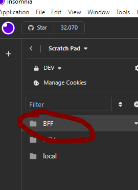
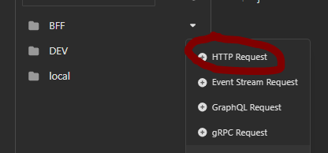
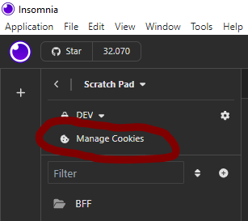
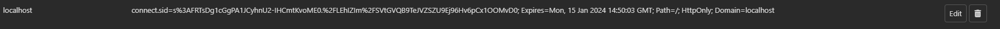
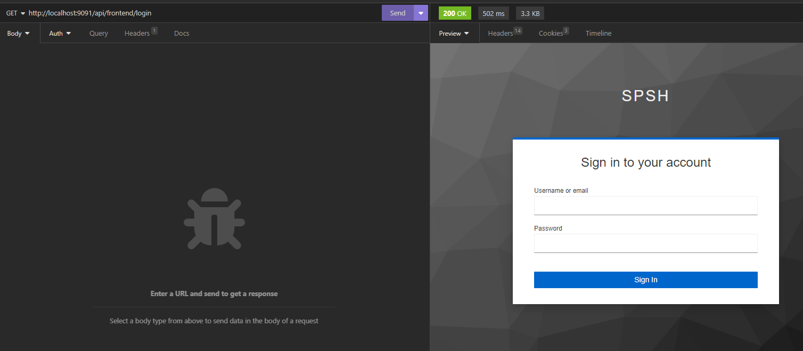

# API manuell testen mit Insomnia
Im Folgenden wird beschrieben wie APIs manuell mithilfe des Tools *Insomnia* getestet werden können.
Hierzu wird in *Insomnia* das *Scratch Pad* verwendet, sodass keine SaaS-Dienste und Cloud-Umgebungen genutzt werden.

Man kann pro Umgebung einen Ordner im *Scratch Pad* erstellen, sodass man die verschiedenen Requests getrennt halten kann.
Dies ist natürlich auch für unterschiedliche Tests möglich, ferner sind Unterordner möglich.



Ein Klick auf das kleine Dreieck rechts neben dem Ordner-Namen öffnet ein Context-Menu, hier **+ HTTP Request** wählen.



Dann oben links den Typ des Request wählen (GET, POST, ...) und die Adresse für den API-Aufruf rechts daneben eintragen.

Sollen Daten im Body mitgesendet werden, kann man diese unter ++Body++ direkt unter dem Request-Typ angeben z.B. im JSON-Format.

")

Bsp. für CreateRole (Backend lokal):

POST http://localhost:9090/api/rolle

BODY:
```json
{
  "name": "MyRole1",
  "administeredBySchulstrukturknoten": "d3aa88e2-c754-41e0-8ba6-4198a34aa0a2"
}
```
Cookies

Einen gültigen Cookie erhält man über die Entwickler-Tools des Browsers, wenn man sich erfolgreich mit dem Test-Nutzer angemeldet hat.
Lokal muss man hierzu das **gesamte** Backend (inkl. Keycloak, Redis und DB) und Frontend laufen haben.
Informationen zum Starten dieser Komponenten in den jeweiligen GitHub Projekten nachlesen:

- [Backend](https://github.com/dBildungsplattform/schulportal-client)
- [Frontend](https://github.com/dBildungsplattform/dbildungs-iam-server)

Starten des gesamten Backends samt Keycloak, Datenbank und Redis ist auch möglich über

## [Docker Compose](./../README.md#Docker%20Compose)

Den Wert des cookies *connect.sid* kopieren und in Insomnia unter **Manage Cookies** im *Scratch Pad* einfügen.






Dieser ist bereits in Insomnia erstellt, wenn man zuvor einen Login über den eingebetteten Browser ausgeführt hat mit einem Login-Request, Bsp.:

GET http://localhost:9090/api/auth/login


